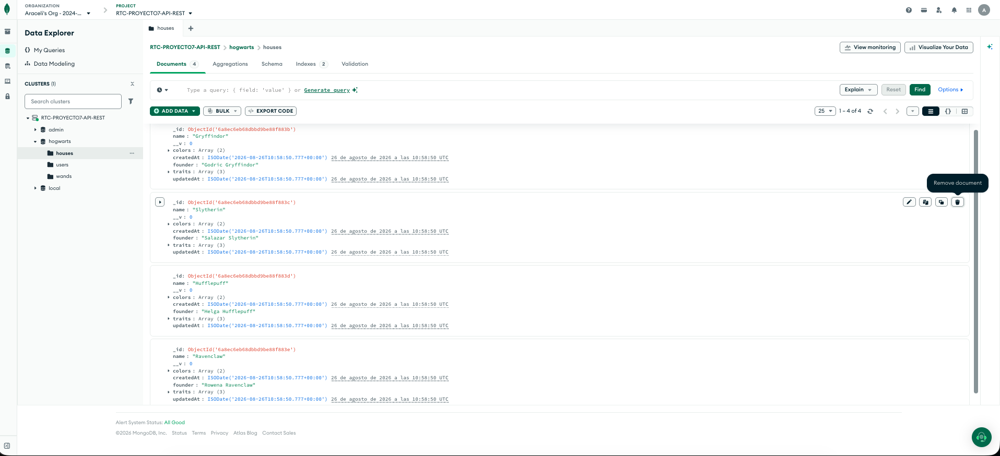
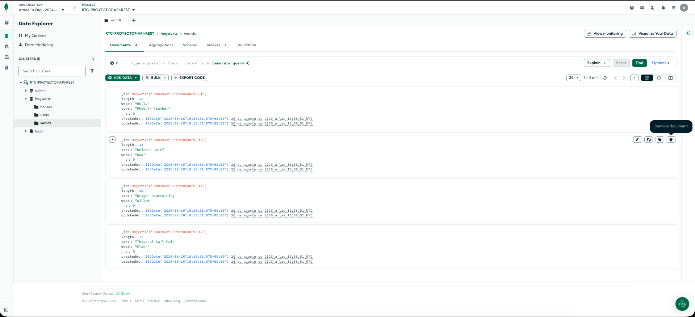
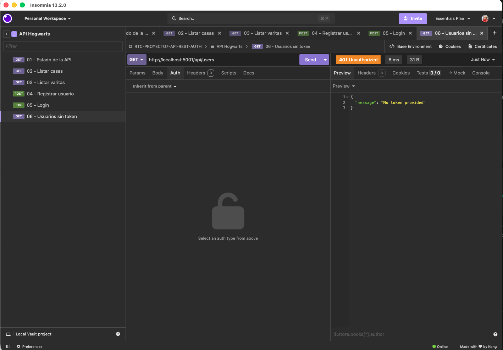
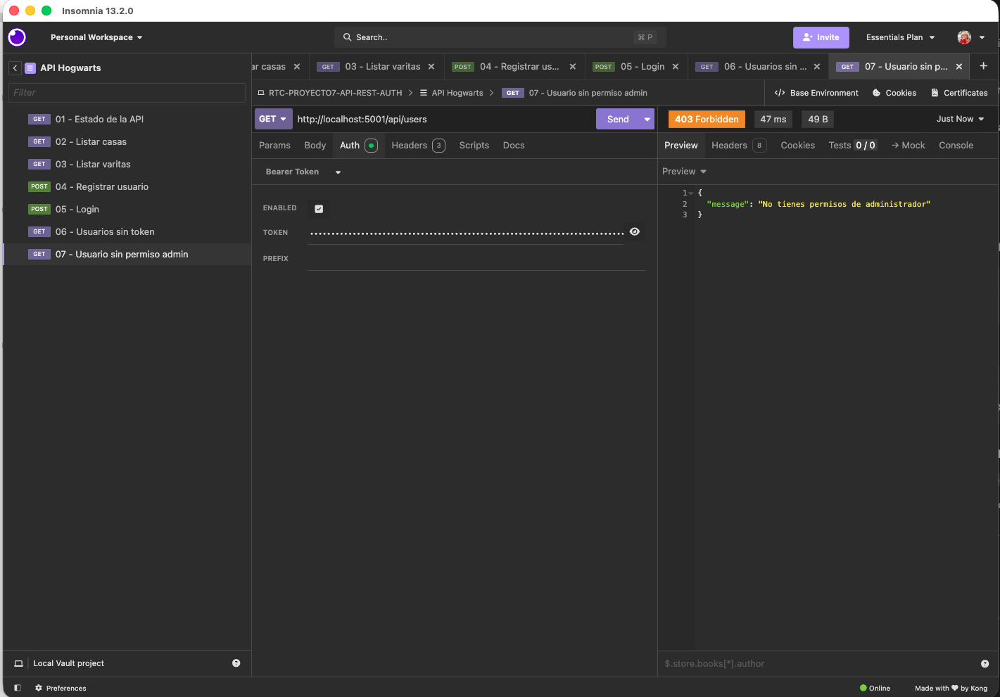
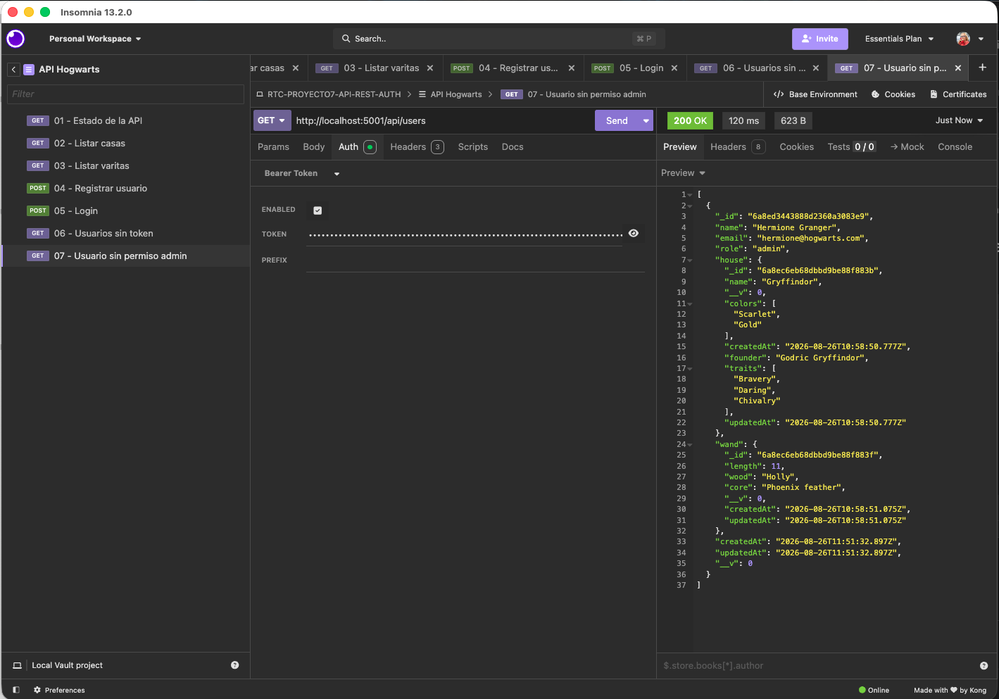
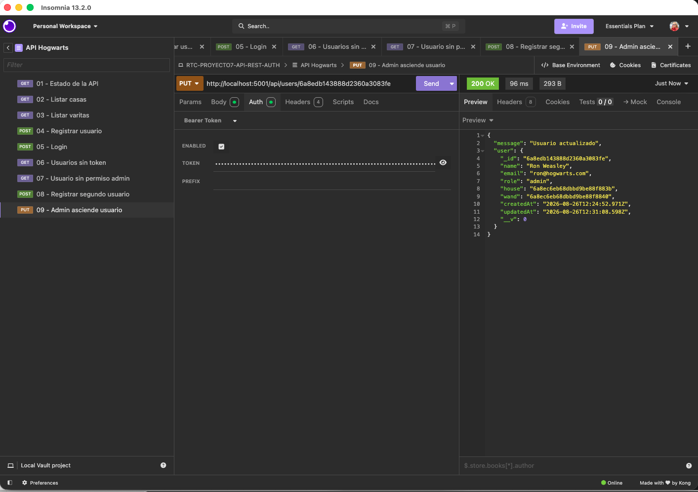
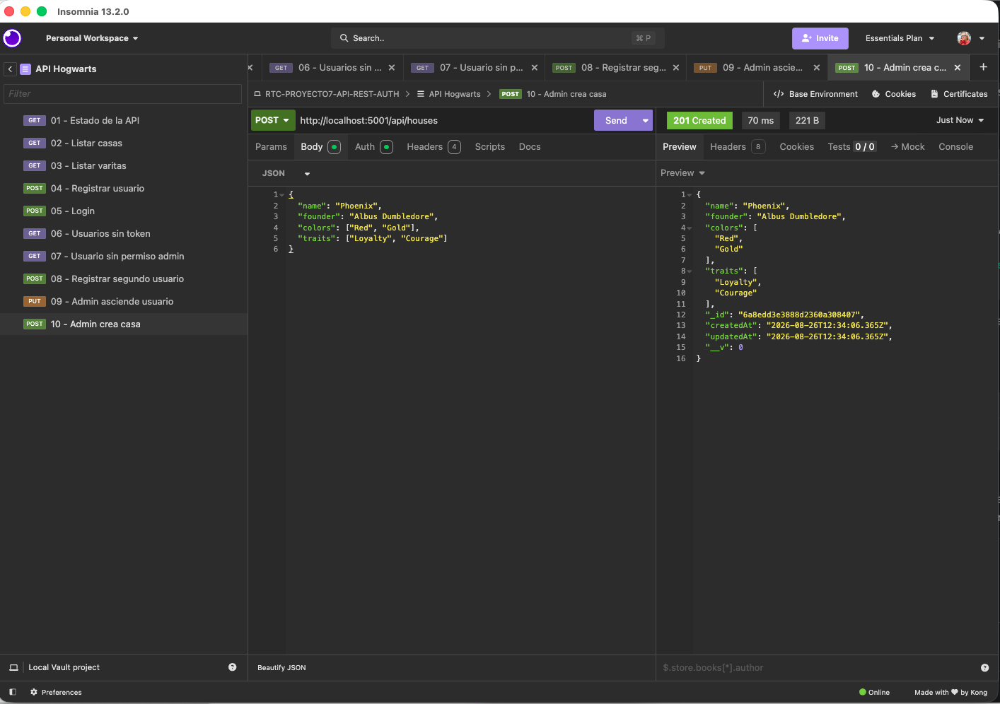
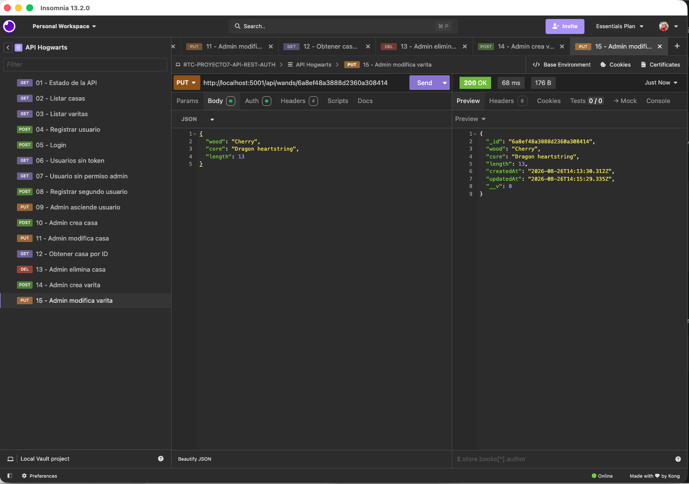
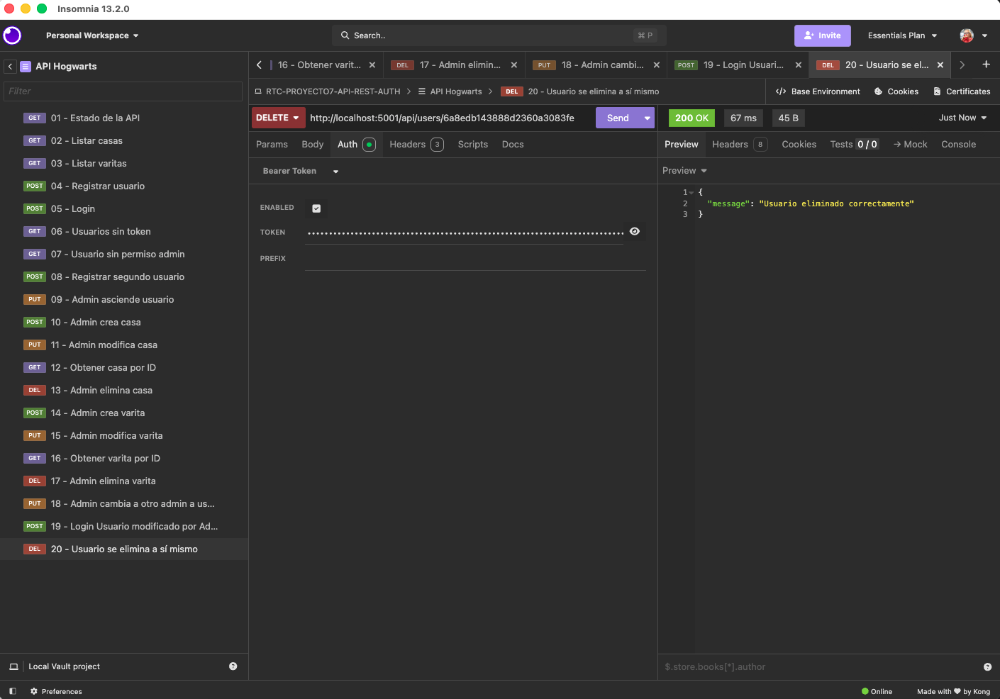
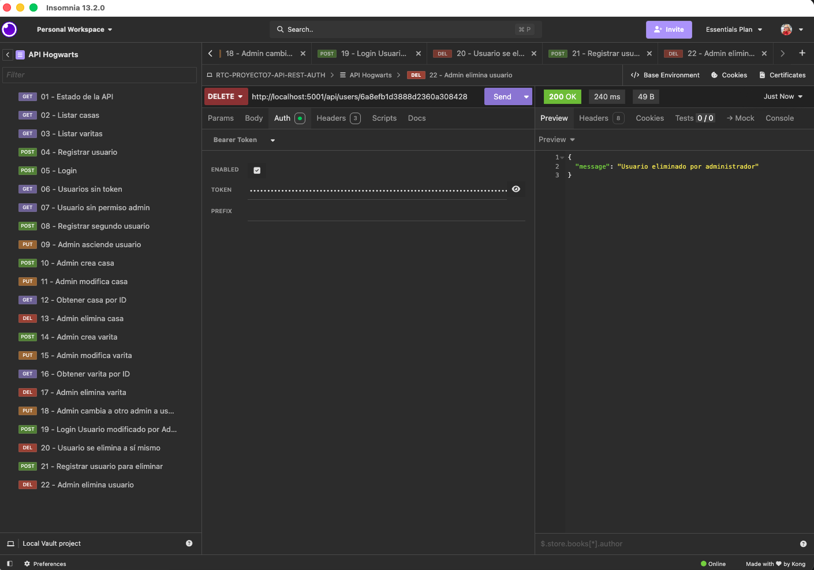

# API REST AUTH - Hogwarts

API REST para gestionar usuarios, casas y varitas dentro de una academia inspirada en Hogwarts. Proyecto académico del módulo Backend Node + Mongo+API REST del máster Rock The Code de The Power Tech School, desarrollado con Node.js, Express, MongoDB Atlas y Mongoose.

[Repositorio](https://github.com/AraceliFradejas/RTC-PROYECTO7-API-REST-AUTH) · [Memoria completa](MEMORIA.md)


## Versión en castellano

La explicación detallada del desarrollo, las decisiones técnicas, las pruebas y las incidencias se encuentra en [MEMORIA.md](MEMORIA.md).

## Tecnologías

- Node.js
- Express
- MongoDB Atlas
- Mongoose
- JSON Web Token
- bcryptjs
- dotenv
- CORS
- Morgan
- Insomnia

## Modelos y relaciones

La API utiliza tres modelos:

### User

| Campo | Tipo | Descripción |
| --- | --- | --- |
| `name` | String | Nombre obligatorio |
| `email` | String | Email obligatorio, único y validado |
| `password` | String | Contraseña cifrada y oculta en las respuestas |
| `role` | String | Solo admite `user` o `admin` |
| `house` | ObjectId | Relación con `House` |
| `wand` | ObjectId | Relación con `Wand` |

### House

Contiene el nombre único de la casa, su fundador, sus colores y sus características.

### Wand

Contiene la madera, el núcleo y la longitud de la varita. La longitud permitida está entre 8 y 18 pulgadas.

Las dos relaciones requeridas se encuentran en el usuario:

```text
User -- house --> House
User -- wand  --> Wand
```

Mongoose utiliza `populate()` para sustituir los identificadores por los documentos relacionados cuando se consulta un usuario.

## Roles y permisos

| Acción | `user` | `admin` |
| --- | :---: | :---: |
| Registrarse e iniciar sesión | Sí | Sí |
| Consultar casas y varitas | Sí | Sí |
| Consultar y editar su perfil | Sí | Sí |
| Eliminar su propia cuenta | Sí | Sí |
| Listar todos los usuarios | No | Sí |
| Cambiar roles | No | Sí |
| Eliminar otros usuarios | No | Sí |
| Crear, modificar o eliminar casas | No | Sí |
| Crear, modificar o eliminar varitas | No | Sí |

El registro siempre fuerza el rol `user`, aunque el cliente envíe `"role": "admin"`. El primer administrador se crea cambiando manualmente su rol en MongoDB Atlas. A partir de ese momento, un administrador puede ascender otros usuarios mediante la API.

## Instalación

1. Clona el repositorio.

```bash
git clone https://github.com/AraceliFradejas/RTC-PROYECTO7-API-REST-AUTH.git
cd RTC-PROYECTO7-API-REST-AUTH
```

2. Instala las dependencias.

```bash
npm install
```

3. Crea un archivo `.env` tomando como referencia `.env.example`.

```env
PORT=5001
JWT_SECRET=tu_secreto_jwt
MONGODB_URI=tu_conexion_de_mongodb_atlas
```

4. Configura en MongoDB Atlas el acceso de red necesario para la corrección y utiliza un usuario de base de datos con permisos limitados exclusivamente a esta base de datos.

5. Ejecuta la semilla.

```bash
npm run seed
```

6. Arranca la API.

```bash
npm start
```

Para desarrollo con recarga automática:

```bash
npm run dev
```

La API estará disponible en `http://localhost:5001`.

> El archivo `.env` real contiene secretos y no se publica en GitHub. Si se solicita para la corrección, debe entregarse por un canal privado y sus credenciales deben rotarse al finalizar.

## Semilla

El comando `npm run seed` crea o actualiza cuatro casas y cuatro varitas. La semilla utiliza operaciones `upsert`, por lo que puede ejecutarse varias veces sin borrar colecciones ni romper relaciones existentes.

## Autenticación

Las rutas protegidas esperan un token en la cabecera:

```http
Authorization: Bearer TOKEN_JWT
```

Los tokens caducan en dos horas. El middleware verifica el token, busca al usuario actual en MongoDB y utiliza su rol guardado en la base de datos para decidir si puede continuar.

## Endpoints

URL base local: `http://localhost:5001`.

### Autenticación

| Método | Endpoint | Acceso | Descripción |
| --- | --- | --- | --- |
| POST | `/api/auth/register` | Público | Registra un usuario con rol `user` |
| POST | `/api/auth/login` | Público | Comprueba las credenciales y devuelve un JWT |

Ejemplo de registro:

```json
{
  "name": "Hermione Granger",
  "email": "hermione@hogwarts.com",
  "password": "password_de_ejemplo",
  "house": "ID_DE_LA_CASA",
  "wand": "ID_DE_LA_VARITA"
}
```

### Usuarios

| Método | Endpoint | Acceso | Descripción |
| --- | --- | --- | --- |
| GET | `/api/users` | Admin | Lista todos los usuarios y sus relaciones |
| GET | `/api/users/:id` | Propietario o admin | Consulta un usuario |
| PUT | `/api/users/:id` | Propietario o admin | Modifica datos permitidos del usuario |
| DELETE | `/api/users/:id` | Propietario o admin | Elimina la cuenta propia o, si es admin, otro usuario |

Un usuario normal puede modificar `name`, `email`, `house` y `wand` de su propia cuenta. El campo `role` solo puede cambiarlo un administrador.

### Casas

| Método | Endpoint | Acceso | Descripción |
| --- | --- | --- | --- |
| GET | `/api/houses` | Público | Lista todas las casas |
| GET | `/api/houses/:id` | Público | Consulta una casa |
| POST | `/api/houses` | Admin | Crea una casa |
| PUT | `/api/houses/:id` | Admin | Modifica una casa |
| DELETE | `/api/houses/:id` | Admin | Elimina una casa si no está asignada a usuarios |

Ejemplo de casa:

```json
{
  "name": "Gryffindor",
  "founder": "Godric Gryffindor",
  "colors": ["Scarlet", "Gold"],
  "traits": ["Bravery", "Daring", "Chivalry"]
}
```

### Varitas

| Método | Endpoint | Acceso | Descripción |
| --- | --- | --- | --- |
| GET | `/api/wands` | Público | Lista todas las varitas |
| GET | `/api/wands/:id` | Público | Consulta una varita |
| POST | `/api/wands` | Admin | Crea una varita |
| PUT | `/api/wands/:id` | Admin | Modifica una varita |
| DELETE | `/api/wands/:id` | Admin | Elimina una varita si no está asignada a usuarios |

Ejemplo de varita:

```json
{
  "wood": "Holly",
  "core": "Phoenix feather",
  "length": 11
}
```

## Códigos de respuesta principales

| Código | Significado |
| --- | --- |
| `200 OK` | Consulta, modificación o eliminación correcta |
| `201 Created` | Recurso creado correctamente |
| `400 Bad Request` | Datos o identificadores no válidos |
| `401 Unauthorized` | Falta el token o no es válido |
| `403 Forbidden` | Usuario autenticado sin permisos suficientes |
| `404 Not Found` | Recurso o ruta no encontrada |
| `409 Conflict` | Email duplicado o recurso relacionado que no puede eliminarse |
| `500 Internal Server Error` | Error interno inesperado |

## Seguridad aplicada

- Contraseñas cifradas con bcrypt antes de guardarse.
- Campo `password` excluido por defecto de las consultas.
- Registro limitado obligatoriamente al rol `user`.
- Tokens JWT con caducidad de dos horas.
- Middleware de autenticación y middleware de administrador.
- Validación de identificadores de MongoDB.
- Comprobación de que las casas y varitas relacionadas existen.
- Bloqueo de eliminación de casas o varitas asignadas a usuarios.
- Lista blanca de campos modificables para evitar cambios no autorizados.
- Respuestas de credenciales incorrectas sin revelar si existe el email.

## Evidencias de funcionamiento

### Datos cargados mediante la semilla





### Autenticación y permisos

Sin token, la ruta protegida responde `401 Unauthorized`:



Un usuario autenticado sin rol de administrador recibe `403 Forbidden`:



Un administrador puede listar usuarios y ver sus relaciones:



Un administrador puede ascender otro usuario:



### CRUD y eliminación de usuarios

Creación de una casa por un administrador:



Actualización de una varita:



Un usuario puede eliminar su propia cuenta:



Un administrador puede eliminar otro usuario:



## Estructura del proyecto

```text
.
├── config/
│   └── db.js
├── middleware/
│   ├── authMiddleware.js
│   └── validateObjectId.js
├── models/
│   ├── House.js
│   ├── User.js
│   └── Wand.js
├── routes/
│   ├── authRoutes.js
│   ├── houseRoutes.js
│   ├── userRoutes.js
│   └── wandRoutes.js
├── screenshots/
├── seeds/
│   └── seed.js
├── .env.example
├── .gitignore
├── package.json
├── README.md
└── server.js
```

## Autora y contribuidora principal

Araceli Fradejas Muñoz

Proyecto realizado para The Power Tech School, máster Rock The Code.

## Redes sociales y enlaces

- GitHub: <https://github.com/AraceliFradejas>
- LinkedIn: <https://www.linkedin.com/in/araceli-fradejas-munoz-transformaciondigital/>
- Instagram: <https://www.instagram.com/goldilocks1013x/>
- X (Twitter): <https://x.com/AraceliFradejas>
- TikTok: <https://www.tiktok.com/@arucci1>
- YouTube: <https://www.youtube.com/@aracelifradejasmunoz2758>
- Medium: <https://medium.com/@araceli.fradejas>

## Nota final

Este proyecto es una entrega académica desarrollada con fines de formación dentro del máster Rock The Code de The Power Tech School. No representa ninguna aplicación oficial de Harry Potter, Hogwarts ni Wizarding World y ha sido creado exclusivamente con fines educativos.

---

## English version

### Academic project

This REST API manages users, Hogwarts-inspired houses and wands in three related MongoDB collections. It is an academic project for the Backend Node + Mongo + API REST module of The Power Tech School's Rock The Code master's program.

The project includes:

- an Express server connected to MongoDB Atlas through Mongoose;
- `User`, `House` and `Wand` models;
- complete CRUD operations for all three collections;
- two user relationships: `User.house` and `User.wand`;
- a repeatable seed with four houses and four wands;
- password hashing with bcrypt;
- JWT authentication with two-hour expiration;
- `user` and `admin` roles with different permissions;
- token, administrator and MongoDB ID validation middleware;
- protected user management and relationship integrity checks;
- manual API verification with Insomnia.

### Roles and permissions

| Action | `user` | `admin` |
| --- | :---: | :---: |
| Register and log in | Yes | Yes |
| Read houses and wands | Yes | Yes |
| Read, update or delete own profile | Yes | Yes |
| List all users | No | Yes |
| Change user roles | No | Yes |
| Delete other users | No | Yes |
| Create, update or delete houses | No | Yes |
| Create, update or delete wands | No | Yes |

Registration always creates a `user`, even if the request body contains `"role": "admin"`. The first administrator must be created manually in MongoDB Atlas. That administrator can then promote other users through the API.

### Models and relationships

```text
User -- house --> House
User -- wand  --> Wand
```

Mongoose `populate()` returns the related house and wand data in user responses. Passwords are hidden by default and are never included in API responses.

### Main API endpoints

Base URL: `http://localhost:5001`

| Resource | Methods and routes |
| --- | --- |
| Authentication | `POST /api/auth/register`, `POST /api/auth/login` |
| Users | `GET /api/users`, `GET/PUT/DELETE /api/users/:id` |
| Houses | `GET/POST /api/houses`, `GET/PUT/DELETE /api/houses/:id` |
| Wands | `GET/POST /api/wands`, `GET/PUT/DELETE /api/wands/:id` |

Protected endpoints expect the following header:

```http
Authorization: Bearer JWT_TOKEN
```

### Run locally

Requirements: Node.js 18 or later and a MongoDB Atlas database.

```bash
git clone https://github.com/AraceliFradejas/RTC-PROYECTO7-API-REST-AUTH.git
cd RTC-PROYECTO7-API-REST-AUTH
npm install
```

Create `.env` in the project root using `.env.example`:

```env
PORT=5001
JWT_SECRET=your_long_random_secret
MONGODB_URI=your_mongodb_atlas_connection
```

Load the initial data and start the server:

```bash
npm run seed
npm start
```

The API will be available at `http://localhost:5001`.

> `.env` contains credentials and is not published. Submission credentials must only be shared through the school's private channel and rotated after assessment.

### Technologies

Node.js · Express · MongoDB Atlas · Mongoose · JWT · bcryptjs · Insomnia

### Author and main contributor

Araceli Fradejas Muñoz

Academic project for The Power Tech School's Rock The Code master's program.

### Social links and profiles

- GitHub: <https://github.com/AraceliFradejas>
- LinkedIn: <https://www.linkedin.com/in/araceli-fradejas-munoz-transformaciondigital/>
- Instagram: <https://www.instagram.com/goldilocks1013x/>
- X (Twitter): <https://x.com/AraceliFradejas>
- TikTok: <https://www.tiktok.com/@arucci1>
- YouTube: <https://www.youtube.com/@aracelifradejasmunoz2758>
- Medium: <https://medium.com/@araceli.fradejas>

### Final note

This project is an academic submission created for educational purposes as part of The Power Tech School's Rock The Code master's program. It is not an official Harry Potter, Hogwarts or Wizarding World application.
